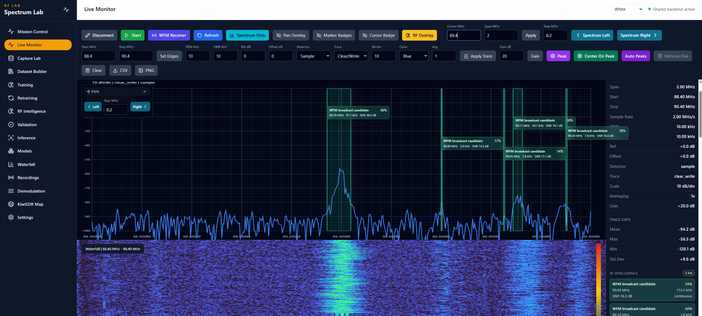
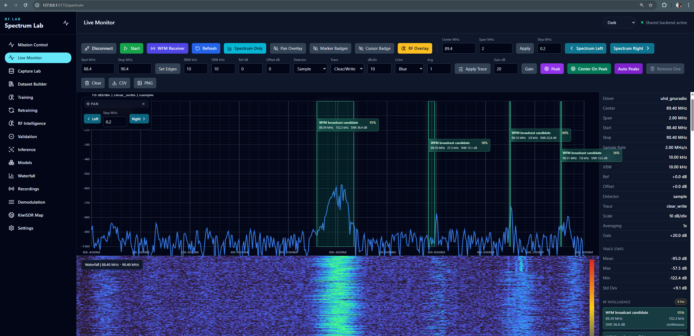
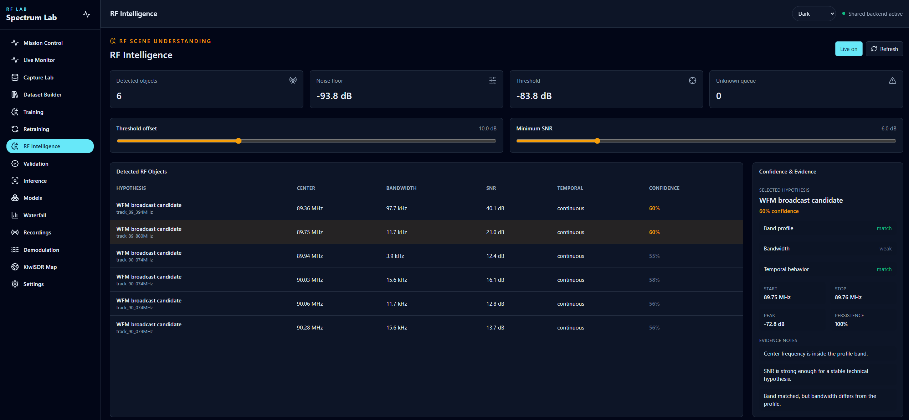
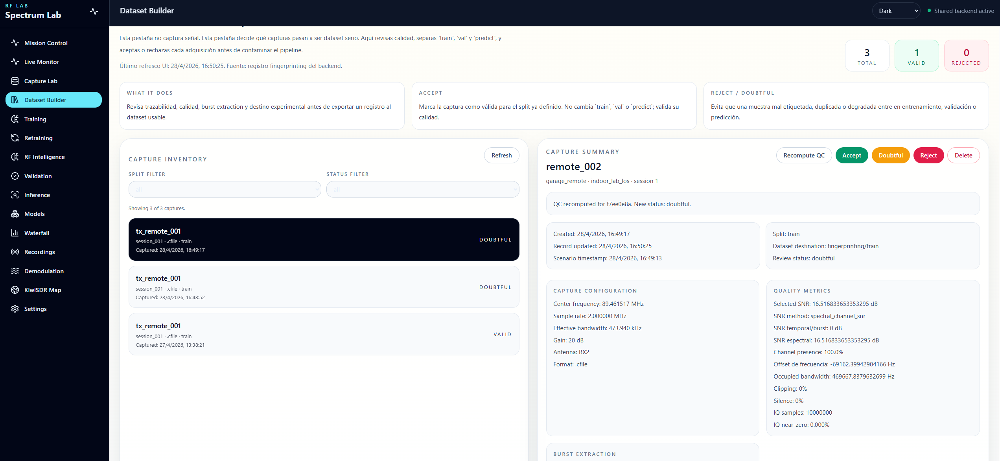

# SpectraEase - RF Spectrum Analyzer

SpectraEase is a web-based RF spectrum analyzer for real SDR hardware. The current development target is an **Ettus Research USRP-B200** connected over USB and accessed through **UHD/GNU Radio** using the RadioConda Python environment.

The application is built with a FastAPI backend and a React/TypeScript frontend. It visualizes live RF spectrum data captured from the device, exposes analyzer-style controls, and supports real capture workflows.

## Current Hardware Path

- Device: **USRP-B200 from Ettus Research**
- Driver/runtime path: **UHD + GNU Radio**
- Python runtime for SDR tools: **RadioConda**
- Default antenna: `RX2`
- Default center frequency: `89.4 MHz`
- Default sample rate/span: `2 MS/s`
- Default gain: `20 dB`


## Features

- Live RF spectrum from the connected USRP-B200
- Analyzer controls for center frequency, start/stop, span, RBW, VBW, reference level, gain, detector mode, and averaging
- Spectrum pan controls to move the tuned window left or right without typing a new frequency
- Marker creation on the trace with frequency and interpolated signal level
- Marker delta readout between the first two markers
- Marker-band demodulation using M1 and M2 as RF limits
- AM/FM/WFM demodulation with WAV audio playback and export from the dashboard
- ASK/FSK/PSK/OOK marker-band IQ capture with metadata export for digital analysis
- Modulated signal analysis tab for marker-limited IQ dataset capture
- Guided `Capture Lab` safety checks for bandwidth, duration, and invalid frequency windows before launching IQ acquisition
- Persistent transparent execution overlay for SDR operations and ML jobs (training, retraining, validation, prediction) that stays visible while navigating between tabs without blocking the interface
- Live marker-band QC preview with peak, noise floor, SNR, and peak frequency before recording
- RF Intelligence tab and optional Live Monitor overlay for real-time RF object detection, bandwidth/SNR estimation, rule-based protocol hypotheses, temporal tracking, and evidence notes
- Automatic RadioConda Python propagation to `Validation` and `Inference` so `python_exe` appears prefilled by default
- Persistent `.cfile` and `.iq` capture libraries for replay workflows and AI model training datasets
- Automatic local peak markers
- Marker dragging directly on the spectrum canvas
- Peak marker detection
- Trace statistics: mean, maximum, minimum, and standard deviation
- CSV export for trace points
- PNG export for the current spectrum canvas
- Mouse-wheel zoom on spectrum span
- Crosshair cursor readout with frequency and level
- Frozen View mode for pausing the current spectrum/waterfall frame in memory while preserving markers, zoom, overlays, and existing detection interactions
- Auto Freeze M1-M2 trigger for fast transient signals inside the marker-defined band
- RF Profile dropdown with hardcoded professional observation presets for reproducible capture and fingerprinting experiments
- Peak Hold overlay with permanent Max Hold and configurable decay
- Marker Band-Pass controls with live FFT-mask preview and real FIR filtering for I/Q capture and demodulation
- Trace modes: Clear/Write, Average, Max Hold, Min Hold, and Video Average
- Detector modes: Sample, RMS, Average, Peak, Max Hold, Min Hold, and Video
- Display controls for reference level, dB/div, offset, and color scheme
- Basic SCPI-style REST command endpoint for external control
- Device status panel showing connection state, driver, sample rate, gain, center, span, start, and stop
- Recording/session screens for capture management
- FastAPI REST API with OpenAPI docs
- React/Vite frontend with canvas-based spectrum rendering

## What The Platform Offers

SpectraEase combines RF acquisition, dataset curation, and RF fingerprinting workflows in one browser-based laboratory interface. It is designed for operators who need to move from live spectrum observation to reproducible machine-learning experiments without changing tools.

Main capabilities:

- Live RF monitoring with analyzer-style controls, markers, measurements, and spectrum/waterfall visualization.
- RF scene understanding that turns live PSD frames into detected RF objects with frequency bounds, SNR, bandwidth, confidence, and explainable labels, with no mock detections in the live path.
- Marker-driven RF capture for focused IQ acquisition around signals of interest.
- Capture Lab workflows for generating train, validation, and prediction datasets with metadata and quality checks.
- Dataset Builder for reviewing captures, assigning splits, and keeping the fingerprinting registry consistent.
- Remote model training and retraining with persistent job tracking across navigation.
- Validation workflows for evaluating trained models against curated validation captures.
- Prediction/inference workflows that produce structured reports with confidence, profile distances, vote stability, and traceability.
- Model registry for inspecting current and historical RF fingerprinting artifacts.
- Non-blocking transparent execution messaging for long-running operations, so users can keep using the application while jobs continue.
- Unified backend API for SDR control, capture management, demodulation, fingerprinting, MLOps, and model reporting.

The execution overlay is intentionally global: if a training, retraining, validation, or prediction job is running, the message remains visible when moving from one page to another, survives refresh through the stored job id, and disappears automatically only when the backend reports that the job has finished. The same transparent non-blocking pattern is used for capture, SDR operations, and MLOps executions so long-running work never traps the operator on one tab.


## Tech Stack

| Component | Technology |
|-----------|------------|
| Backend | FastAPI, Python |
| Frontend | React 18, TypeScript, Vite |
| SDR | UHD, GNU Radio, RadioConda |
| Device | Ettus Research USRP-B200 |
| Storage | JSON/file-based project storage |

## Run On Windows

Before starting the app, install the Ettus UHD runtime/USB drivers for Windows and confirm UHD can see the USRP:

- Windows 11 UHD builds/drivers: `https://files.ettus.com/binaries/uhd/latest_release/Windows11/VS2026/`
- All latest UHD release builds: `https://files.ettus.com/binaries/uhd/latest_release/`

After installing or reinstalling the driver, run:

```powershell
& 'C:\Program Files\UHD\bin\uhd_find_devices.exe'
& 'C:\Program Files\UHD\bin\uhd_usrp_probe.exe'
```

The app will only work once UHD lists and probes the USRP successfully.

Use PowerShell from the project root:

```powershell
cd C:\path\to\spectrum-lab

$env:DEFAULT_CENTER_FREQUENCY_HZ="89400000"
$env:DEFAULT_SAMPLE_RATE_HZ="2000000"
$env:DEFAULT_GAIN_DB="20"
$env:DEFAULT_ANTENNA="RX2"
$env:UHD_DEVICE_ARGS=""

powershell -ExecutionPolicy Bypass -File .\scripts\run_dev.ps1 -UseRealSdr 1 -RadioCondaPythonPath "<radioconda-python-path>"
```

Arranque unificado recomendado para la plataforma fusionada:

```powershell
cd C:\path\to\spectrum-lab
powershell -ExecutionPolicy Bypass -File .\start_unified.ps1
```

Si quieres pasar explícitamente el usuario y la IP del entrenamiento remoto, usa:

```powershell
cd C:\path\to\spectrum-lab
powershell -ExecutionPolicy Bypass -File .\start_unified.ps1 -RemoteUser "<ssh-user>" -RemoteHost "<training-host>"
```

Esos valores quedan además precargados en la pestaña `Training`.
El mismo arranque propaga también `RadioCondaPythonPath` al frontend para que `Validation` e `Inference` muestren `python_exe` ya detectado por defecto.
Si quieres precargar también la activación del entorno remoto clásico, usa `-RemoteVenvActivate "<remote-venv-activate-path>"` al arrancar con `run_dev.ps1`.

Ese comando levanta en una sola orden:

- backend FastAPI unificado,
- frontend Vite,
- monitor SDR en vivo,
- Capture Lab,
- Dataset Builder,
- Training,
- Retraining,
- Validation,
- Inference,
- Models.

Polling frontend-backend por defecto:

- `App sync` (`/api/device/status`, `/api/recordings/`, `/api/sessions/`, `/api/presets/`): `5000 ms`
- `Spectrum`: `100 ms`
- `Waterfall`: `100 ms`

Puedes sobrescribirlos al arrancar sin tocar código:

```powershell
powershell -ExecutionPolicy Bypass -File .\scripts\run_dev.ps1 `
  -UseRealSdr 1 `
  -RadioCondaPythonPath "<radioconda-python-path>" `
  -AppSyncIntervalMs 10000 `
  -SpectrumPollIntervalMs 250 `
  -WaterfallPollIntervalMs 400
```

En Linux/macOS con `run_dev.sh`:

```bash
APP_SYNC_INTERVAL_MS=10000 SPECTRUM_POLL_INTERVAL_MS=250 WATERFALL_POLL_INTERVAL_MS=400 bash scripts/run_dev.sh
```

Then open:

- Frontend: `http://localhost:5173`
- Backend API: `http://localhost:8000`
- API docs: `http://localhost:8000/docs`

## Basic Workflow

1. Connect the USRP-B200 over USB.
2. Start the app with `run_dev.ps1` and `-UseRealSdr 1`.
3. Open the frontend.
4. Click `Connect USB`.
5. Click `Start`.
6. Tune center/span or start/stop from the controls.
7. Use `Spectrum Left` and `Spectrum Right` to move across the band.
8. Enable `RF Overlay` in `Live Monitor` or open `RF Intelligence` to inspect automatically detected RF objects, candidate labels, confidence, and evidence.
9. Click the spectrum to add markers with frequency and signal level.
10. Open `Demodulation` to demodulate or capture the RF band between M1 and M2.
11. Open `Capture Lab` to capture IQ for `train`, `val`, or `predict`.
12. Use `Dataset Builder` to accept, reject, or mark the imported capture as doubtful before using it in ML workflows.
13. Continue in `Training`, `Validation`, or `Inference` according to the split assigned during capture.

## Application Screenshots

The interface is organized as a complete RF lab: live monitoring, waterfall inspection, RF intelligence, marker-band demodulation, IQ capture, and dataset review.

<table>
  <tr>
    <td width="50%">
      
      <br>
      <strong>Live Spectrum Monitor</strong>
      <br>
      Analyzer-style controls, cursor readout, markers, trace statistics, and export actions around the real USRP-B200 stream.
    </td>
    <td width="50%">
      
      <br>
      <strong>Spectrum And Waterfall Workspace</strong>
      <br>
      Synchronized spectrum and waterfall views for inspecting frequency activity over time with the same center/span context.
    </td>
  </tr>
  <tr>
    <td width="50%">
      
      <br>
      <strong>RF Intelligence Overlay</strong>
      <br>
      Transparent live detections over the spectrum/waterfall view, generated from real RF Intelligence analysis.
    </td>
    <td width="50%">
      
      <br>
      <strong>RF Intelligence Console</strong>
      <br>
      Detected RF objects, confidence, SNR, bandwidth, temporal behavior, and explainable evidence notes.
    </td>
  </tr>
  <tr>
    <td width="50%">
      
      <br>
      <strong>Marker-Band Demodulation</strong>
      <br>
      AM/FM/WFM audio workflows and digital modulation IQ capture driven by M1/M2 marker limits.
    </td>
    <td width="50%">
      
      <br>
      <strong>Capture Lab</strong>
      <br>
      Reproducible `.cfile` / `.iq` acquisition with frequency guardrails, labels, splits, metadata, and QC preview.
    </td>
  </tr>
  <tr>
    <td width="50%">
      
      <br>
      <strong>Dataset Builder Review</strong>
      <br>
      Capture curation with QC metrics, review status, dataset split assignment, and RF fingerprinting readiness.
    </td>
    <td width="50%">
      
      <br>
      <strong>Marker-Band IQ Export</strong>
      <br>
      Focused `.cfile` / `.iq` generation from selected marker bandwidths for replay, analysis, and ML datasets.
    </td>
  </tr>
</table>

<details>
<summary>Additional waterfall reference</summary>


</details>

## RF Intelligence

## Frozen View

The dashboard provides a Frozen View mode that allows the operator to pause the visual update of the current spectrum and waterfall while preserving the same interaction capabilities available in Live View.

Use:

```text
Freeze View
-> inspect the frozen spectrum/waterfall
-> move markers
-> zoom or pan with the existing controls
-> inspect RF Intelligence / RF Signal Understanding overlays
-> Resume Live
```

Frozen View is not a new analysis pipeline. It is the same Live View fed by an in-memory copy of the last visible frame instead of the live stream:

```text
Live View:   source = current_live_spectrum_frame
Frozen View: source = frozen_spectrum_frame
```

The mode does not save files, does not capture I/Q, does not create datasets, does not export evidence, and does not add new models. `Resume Live` clears the frozen frame from memory and returns the dashboard to live frame consumption.

## Spectrum Observation Tools

### RF Profile Dropdown

The `Spectrum` view includes a hardcoded `RF Profile` dropdown for serious, repeatable observation setups. A profile is not only a visual marker preset. It defines a stable RF observation configuration so captures made under the same profile are comparable.

When a profile is selected, the dashboard applies:

- center frequency;
- start/stop frequency and span;
- recommended gain;
- Marker 1 and Marker 2 as the useful analysis band;
- a center marker;
- signal type, RF family, expected modulation, expected bandwidth, temporal pattern, recommended capture duration, and training notes.

The selected profile is stored locally and passed to RF Signal Understanding captures as `profile_key` plus profile metadata. This is important for RF fingerprinting: captures from different transmitters should use the same profile, channel, span, sample rate, gain, antenna, distance policy, and marker band when the experiment is meant to compare transmitter identity.

### Peak Hold And Max Hold

The live spectrum supports a visual peak trace:

- `Permanent`: maximum observed power per FFT bin is retained until `Reset Peaks`.
- `Decay`: the held peak decays at a configurable rate (`1`, `3`, or `6 dB/s`).

This is a visual analysis mode. It does not save I/Q, does not create dataset records, and does not trigger capture. If `Use Peak For Detection` is enabled, markers, local measurements, peak search, RF Intelligence overlay, and RF Signal Understanding overlay consume the peak trace instead of the instantaneous live trace.

### Marker Band-Pass

`Band-Pass On/Off` uses Marker 1 and Marker 2 as the selected band:

```text
band_start_hz = min(M1, M2)
band_stop_hz  = max(M1, M2)
bandwidth_hz  = band_stop_hz - band_start_hz
```

There are two different implementations, and the distinction matters:

1. Live spectrum preview: the frontend only has FFT power bins, not raw I/Q. Therefore the live spectrum uses an FFT-bin soft mask preview. Bins outside M1-M2 are attenuated by the selected preview attenuation so the operator can visually focus on the selected band.
2. I/Q capture and demodulation: the backend has complex I/Q samples. When the filter is enabled, the backend applies a real FIR Kaiser filter to the captured complex baseband samples before saving I/Q, demodulating audio, or adding samples to the learning loop.

Available stopband attenuation values are `1`, `3`, `6`, `10`, `20`, `40`, and `60 dB`. Filter metadata is written with the capture/demodulation result, including filter type, passband width, cutoff, transition width, requested stopband attenuation, number of taps, and Kaiser beta.

For live FFT preview the UI labels the mode as:

```text
FFT mask preview / FIR on I/Q capture
```

This avoids treating a visual FFT mask as a physical RF filter.

## RF Signal Understanding Module

The `rf_signal_understanding` module is an experimental second RF analysis pipeline designed to run in parallel with the legacy `rf_intelligence` module.

The legacy `rf_intelligence` module performs classical rule-based RF candidate classification using PSD thresholding, frequency range, occupied bandwidth, SNR and predefined band profiles.

The new `rf_signal_understanding` module follows a waterfall-based and evidence-fusion approach. It generates time-frequency representations, detects candidate signal regions, classifies region crops with cautious signal-type hypotheses, extracts spectral features, optionally extracts bispectral features from offline I/Q segments, and compares its output against the legacy RF Intelligence baseline.

Current maturity:

- live mode uses PSD/waterfall frames, not raw I/Q;
- offline mode can analyze `.iq` and `.cfile` captures;
- the current detector is morphological and heuristic;
- SSD and Faster R-CNN hooks exist, but no trained detector is enabled yet;
- the current waterfall classifier remains heuristic, but the signal-type softmax classifier can now be trained from the UI;
- the trained signal-type classifier is saved locally as `models/mlp_spectral_classifier/model.npz`;
- if I/Q region segments are available, training uses fixed-length spectral features from I/Q;
- if only reviewed live/metadata samples exist, the module can train a metadata-only bootstrap model so the operator can start iterating immediately;
- remote training controls are visible for future RSU runner support, but RSU signal-type training currently runs locally;
- the module must not be interpreted as confirmed protocol decoding.

The module is intended to support a progressive scientific workflow:

1. capture RF data;
2. generate waterfall representations;
3. detect candidate regions;
4. manually review and label regions;
5. export labelled waterfall-region datasets;
6. train signal-type classifiers;
7. train ML region detectors;
8. validate by SNR, frequency, gain, session, day and environment;
9. compare against the legacy `rf_intelligence` baseline.

Current simplified operator workflow:

1. In `Spectrum`, place Marker 1 and Marker 2 around the signal region to teach.
2. Open `RF Signal Understanding`.
3. In `Simple learning flow`, type the desired cautious label, for example `fm_broadcast_like`, `NOISE`, `ook_like`, or `unknown`.
4. Press `Teach this signal`.
5. The system captures I/Q for the marker band, analyzes it, selects a candidate region, and saves a labelled training sample.
6. Repeat for at least two different classes.
7. Press `Train signal-type classifier` in local mode.
8. Enable `Understanding Overlay` in `Spectrum` and choose `Hybrid` or `AI Only`.

The low-level API workflow remains available for scripts and experiments:

1. `POST /api/rf-signal-understanding/analyze` on `.iq` or `.cfile` captures creates waterfall, region crops, and I/Q segments.
2. `POST /api/rf-signal-understanding/regions/review` stores strong labels.
3. `POST /api/rf-signal-understanding/train-classifier-incremental` trains the current signal-type classifier.
4. `POST /api/rf-signal-understanding/validate` can validate `task = signal_type_classification`.

Example region review:

```json
{
  "analysis_id": "rsu_20260429_001",
  "bbox_id": "box_001",
  "label": "fm_broadcast_like",
  "review_status": "corrected",
  "reviewer": "operator",
  "notes": "Manual review corrected the candidate label."
}
```

Example dataset export:

```json
{
  "analysis_ids": ["rsu_20260429_001"],
  "dataset_name": "signal_type_regions_v1",
  "include_unreviewed": false
}
```

Example incremental classifier training:

```json
{
  "dataset_name": "learning_buffer",
  "model_type": "mlp_spectral_classifier",
  "new_model_id": "signal_type_softmax_v1",
  "execution_target": "local",
  "include_weak_labels": true,
  "weak_label_weight": 0.4,
  "min_samples_per_class": 1,
  "epochs": 250,
  "learning_rate": 0.05,
  "test_split": 0.25,
  "feature_bins": 128
}
```

The first trainable classifier is a lightweight NumPy softmax model saved as `models/mlp_spectral_classifier/model.npz` with `metadata.json`. Versioned copies are written under `learning_buffer/model_versions/<model_id>/`. Region detector training remains a separate task and requires labelled waterfall images with bounding-box ground truth.

### Spectrum Understanding Overlay

The live `Spectrum` page exposes `Understanding Overlay` for the new RF Signal Understanding pipeline. When enabled, the overlay has two modes:

- `Hybrid`: current default. A morphological region detector proposes time-frequency regions, heuristic classifiers and the trained signal-type classifier provide evidence, and the fusion layer decides the displayed label.
- `AI Only`: only regions that receive a prediction from the trained `trained_signal_type_classifier` are displayed. The initial region proposal is still morphological; the trained model controls the displayed signal-type hypothesis.

This means current training improves the classification of detected regions, not the region detector itself. A future SSD/Faster R-CNN/YOLO region detector would be a separate training task.

### Current AI Model: Scientific And Technical Definition

The current trainable model in `rf_signal_understanding` is a lightweight supervised signal-type classifier:

```text
numpy_softmax_regression
```

Scientifically, this is a multiclass linear softmax classifier, equivalent to multinomial logistic regression. It is not a CNN, YOLO, SSD, Faster R-CNN, Transformer, or deep neural network. Its current task is signal-type classification over already proposed RF regions.

The model answers:

```text
"Given this detected RF region, which learned signal-type label does it most resemble?"
```

It does not answer:

```text
"Where is every signal in the spectrum?"
"Which exact protocol was decoded?"
"Which physical transmitter produced this emission?"
```

#### Mathematical Form

Each reviewed training sample is converted into a numeric feature vector:

```text
x in R^n
```

For `K` labels, the model learns:

```text
W in R^(n x K)
b in R^K
```

It computes:

```text
logits = xW + b
p(class_i | x) = exp(logit_i) / sum(exp(logit_j))
```

The predicted label is:

```text
argmax_i p(class_i | x)
```

Training minimizes multiclass cross-entropy with gradient descent, optional per-sample weights, and light L2 regularization.

#### Feature Inputs

When I/Q segments are available, the model uses spectral features:

```text
I/Q segment
-> FFT / PSD
-> fixed-length spectral vector
-> z-score normalization
-> softmax classifier
```

When I/Q segments are not yet available, the system can train a metadata-only bootstrap model from reviewed region metadata:

```text
center frequency
occupied bandwidth
sample rate
SNR when available
gain when available
duration
candidate confidence
constant bias feature
-> softmax classifier
```

The metadata bootstrap mode is useful for starting the learning loop immediately, but it is weaker than I/Q-backed training because it learns RF context and coarse region descriptors rather than the actual signal shape.

#### Learning Process

The intended operator loop is:

```text
Marker 1 / Marker 2 define the RF region
-> operator enters a cautious label
-> Teach this signal
-> capture/analyze the region
-> store a labelled sample in the learning buffer
-> train signal-type classifier
-> save a versioned model
-> use the model in live Understanding Overlay
-> correct mistakes
-> retrain
```

The learning buffer stores traceability for every sample:

```text
sample_id
analysis_id
bbox_id
iq_path when available
region_image_path when available
label
label_source
label_strength
training_weight
center_frequency_hz
occupied_bandwidth_hz
snr_db
sample_rate_hz
gain_db
session_id
capture_id
created_at
```

The active model is stored at:

```text
backend/app/modules/rf_signal_understanding/models/mlp_spectral_classifier/model.npz
```

The model metadata is stored at:

```text
backend/app/modules/rf_signal_understanding/models/mlp_spectral_classifier/metadata.json
```

Every training run also writes a versioned copy under:

```text
backend/app/infrastructure/persistence/storage/rf_signal_understanding/learning_buffer/model_versions/<model_id>/
```

#### Hybrid Mode

`Hybrid` mode combines classical detection, heuristic classification, the trained classifier, and decision fusion:

```text
live waterfall / PSD frames
-> morphological region detector proposes active regions
-> heuristic waterfall classifiers produce cautious labels
-> trained_signal_type_classifier produces a learned label if available
-> decision_fusion_pipeline combines the evidence
-> overlay displays the fused result
```

In this mode, the system may still display regions even when the trained model is absent or uncertain, because the heuristic and fusion layers remain active. This mode is useful for exploration, dataset creation, and comparison against the legacy `rf_intelligence` baseline.

#### AI Only Mode

`AI Only` mode is stricter:

```text
live waterfall / PSD frames
-> morphological region detector proposes active regions
-> trained_signal_type_classifier must classify the region
-> only AI-classified regions are displayed
```

Important: `AI Only` does not mean end-to-end AI detection yet. The first region proposal is still generated by the morphological detector. The trained AI model controls the signal-type hypothesis and whether a proposed region is shown as an AI-classified result.

#### Current Limitations

The current trainable model is a supervised baseline for signal-type classification. It is not:

```text
an object detector
a protocol decoder
a transmitter fingerprint model
an end-to-end RF recognition network
a Wi-Fi/Bluetooth/ZigBee/LTE confirmation system
```

Therefore labels must remain cautious:

```text
fm_broadcast_like
ook_like
fsk_like
ofdm_like
wideband_noise_like
NOISE
unknown
ambiguous
```

Protocol confirmation would require future standard-specific decoding, synchronization, or validated protocol detectors. Transmitter identification would require a separate fingerprinting model trained and evaluated with device-level labels.

## Model Training Strategy

The `rf_signal_understanding` module separates model training into three independent tasks.

### 1. Signal-Type Classification

The first trainable model is a supervised signal-type classifier. It is trained from exported labelled regions stored in a dataset `manifest.json`. Each sample may include an I/Q segment, a waterfall crop, RF metadata, a label, the label source and the label strength.

The initial baseline uses fixed-length spectral features extracted from I/Q segments and trains a NumPy-based multiclass softmax classifier. If I/Q segments are not yet available, a metadata-only bootstrap mode can train from reviewed labels, center frequency, occupied bandwidth, confidence, and related RF metadata. The bootstrap mode is useful for starting the loop immediately, but it should be replaced by I/Q-backed training as soon as enough captures exist. The model is saved as `model.npz` with an associated `metadata.json`.

This model predicts cautious signal-type hypotheses such as `fm_broadcast_like`, `ook_like`, `fsk_like`, `ofdm_like`, `wideband_noise_like` and `unknown`.

### 2. Region Detection

The region detector is a separate model. It requires waterfall images annotated with bounding boxes. It must not be mixed with signal-type classification. Candidate models include SSD, Faster R-CNN and YOLO. The region detector is evaluated with IoU, mAP, precision, recall, false positives and false negatives.

### 3. Transmitter Fingerprinting

The transmitter fingerprint model is a third task. It uses I/Q segments and hardware-related features, including spectral and bispectral descriptors, to distinguish individual transmitters. It is evaluated with closed-set accuracy, open-set AUROC, EER, FAR and FRR.

### Legacy-Guided Active Learning

The module supports a legacy-guided active learning strategy. The legacy `rf_intelligence` module acts as a weak teacher by generating pseudo-labels when confidence is high. Operator-confirmed labels and corrected labels are treated as strong labels. Training uses strong labels with full weight and weak labels with reduced weight. Each training run produces a versioned model and metadata to preserve traceability.

The proposed strategy follows a legacy-guided active learning approach. Instead of replacing the legacy RF Intelligence module, the system uses it as a weak teacher to bootstrap labelled datasets from real RF captures. The new RF Signal Understanding module learns progressively from a combination of weak labels, operator-confirmed labels and corrected labels. This creates a controlled transition from rule-based RF candidate profiling to supervised signal-type classification, while preserving traceability, model versioning and scientific comparability.

This approach is especially useful in RF environments where fully labelled datasets are expensive to build. The legacy module provides initial weak supervision, the operator resolves uncertain cases through marker-based review, and the trained model is evaluated against both manually reviewed samples and the legacy baseline.

Learning buffer:

```text
backend/app/infrastructure/persistence/storage/rf_signal_understanding/learning_buffer/
  samples/
  manifest.json
  pseudo_labels.json
  strong_labels.json
  model_versions/
```

Weak pseudo-labels are accepted only when the legacy confidence is at least `0.85`. Automatic pseudo-labels are disabled in ambiguous 2.4 GHz bands unless the operator confirms the label. Strong labels have `training_weight = 1.0`; weak labels normally use `0.3` to `0.4`. `unknown` is a real class. `ambiguous` samples are not used for training unless explicitly included in a future workflow.

Incremental classifier training:

```json
{
  "dataset_name": "learning_buffer",
  "base_model_id": "signal_type_softmax_v1",
  "new_model_id": "signal_type_softmax_v2",
  "include_weak_labels": true,
  "weak_label_weight": 0.4,
  "min_samples_per_class": 1,
  "split_strategy": "session_id"
}
```

Use:

```text
POST /api/rf-signal-understanding/regions/pseudo-label
POST /api/rf-signal-understanding/train-classifier-incremental
POST /api/rf-signal-understanding/compare-models
```

Every incremental run writes a new version under `learning_buffer/model_versions/<model_id>/` and does not erase previous version metadata.

### Closed-Loop RF Signal Learning

The UI is intended to hide the low-level endpoint workflow from the operator. The `RF Signal Understanding` tab includes:

- `Simple learning flow`, where the operator enters a label and presses `Teach this signal` to capture, analyze, review, and add one trainable sample from the M1/M2 marker band;
- `Capture I/Q for training`, which captures I/Q through Capture Lab, registers the file, analyzes it, and prepares regions for review;
- `Captured RF files`, the internal capture registry;
- `Active learning review`, where the operator confirms, corrects, marks unknown, marks ambiguous, or sends a weak legacy label;
- `Training Queue`, showing strong labels, weak labels, unknowns, excluded/ambiguous samples and samples per class;
- `Train signal-type classifier`, which calls incremental batch training and writes a new model version.

The system implements a closed-loop RF learning workflow where legacy rule-based detection, I/Q capture, waterfall analysis, human review, weak supervision, supervised training, model versioning and validation are integrated into a single iterative process. Live-only reviews can bootstrap a metadata model, but training-quality models should progressively move toward captured I/Q samples registered through the training loop.

Important current limitation:

- Training a signal-type classifier does not train the region detector.
- `AI Only` means only AI-classified proposed regions are shown; the region proposal itself is still generated by the morphological detector.
- Remote RSU training is reserved for a future dedicated runner. Use local mode for the current `numpy_softmax_regression` signal-type classifier.

Scientific traceability:

| Component | Supporting paper |
|---|---|
| STFT waterfall generation | A Radio Frequency Signal Recognition Method Based on Spectrogram |
| Waterfall region extraction | A Radio Frequency Signal Recognition Method Based on Spectrogram |
| SSD-style waterfall object detection | RF Fingerprint Recognition Based on Spectrum Waterfall Diagram |
| MLP over spectrogram rows | Simple Detection and Classification of Spectrogram RF Signals Using a Four-Layer Perceptron |
| Bispectrum-waterfall feature fusion | Bispectrum-Based Signal Processing Using Waterfall Features |

The `RF Intelligence` tab adds a first operational layer of RF scene understanding on top of the live spectrum stream. It does not try to decode private communications or claim protocol confirmation. It detects active RF regions and produces technical hypotheses that are useful for monitoring, triage, and dataset capture planning.

The same detector can also be displayed directly in `Live Monitor` with the `RF Overlay` button. When enabled, the spectrum canvas shows transparent frequency bands over the live trace, aligned to the detected `start_frequency_hz` and `stop_frequency_hz`. Each overlay label shows the candidate family, confidence, center frequency, bandwidth, and SNR. The right-side monitor panel also lists the current RF Intelligence detections.

The live UI path is not mocked. `RF Overlay` and the `RF Intelligence` tab call `GET /api/rf-intelligence/live`, which analyzes the latest frame returned by `real_spectrum_stream.get_latest(...)`. If the SDR is not connected, the stream is stopped, or the backend has no live `frequencies_hz` and `levels_db`, the detector returns an empty scene instead of fabricated detections.


The current implementation is intentionally classical and explainable:

1. Estimate the noise floor from the live PSD using a robust median.
2. Apply an adaptive threshold.
3. Group adjacent active bins into RF object candidates.
4. Estimate center frequency, start/stop frequency, bandwidth, occupied bandwidth, peak power, mean power, and SNR.
5. Compare the candidate against band profiles.
6. Assign a rule-based label, confidence, temporal type, and evidence notes.
7. Track repeated detections across live refreshes.

Initial rule profiles include:

- WFM broadcast in the European FM band
- 433 MHz OOK/FSK remote-control style signals
- 868 MHz ISM narrowband signals
- Wi-Fi 2.4 GHz candidates
- Bluetooth/BLE hopping candidates
- ZigBee / IEEE 802.15.4 candidates
- LTE candidates
- 5G NR sub-6 candidates
- Unknown RF signal when no profile is strong enough

Example output from the backend:

```json
{
  "label": "WFM broadcast candidate",
  "candidate_family": "broadcast_fm",
  "confidence": 0.95,
  "center_frequency_hz": 98400000,
  "bandwidth_hz": 180000,
  "snr_db": 38.2,
  "temporal_type": "continuous",
  "evidence": {
    "frequency_band_match": true,
    "bandwidth_match": true,
    "temporal_match": true,
    "notes": [
      "Center frequency is inside the profile band.",
      "Occupied bandwidth is inside the expected range."
    ]
  }
}
```

API endpoints:

```text
GET  /api/rf-intelligence/live
POST /api/rf-intelligence/analyze
```

Useful query parameters for the live endpoint:

- `threshold_offset_db`: dB above the estimated noise floor. Default: `10.0`.
- `min_snr_db`: minimum candidate SNR. Default: `6.0`.
- `min_bins`: minimum contiguous active FFT bins. Default: `2`.
- `merge_gap_bins`: inactive gap tolerated while merging active regions. Default: `2`.

Scientific boundary:

- Detection means there is an active RF region.
- Classification means the frequency, bandwidth, and shape match a technical profile.
- Confirmation of Wi-Fi, Bluetooth, LTE, or 5G would require deeper protocol-specific analysis, IQ features, temporal tracking, or later ML models.

This module is the intended base for later CFAR detection, waterfall object detection, IQ modulation classification, anomaly detection, and auto-capture of unknown signals.

## Marker-Band Demodulation

The `Demodulation` tab uses the first two spectrum markers as the selected RF band:

1. Create M1 and M2 on the spectrum trace.
2. Open `Demodulation`.
3. Select `AM`, `FM`, `WFM`, `ASK`, `FSK`, `PSK`, or `OOK`.
4. Set the capture duration.
5. Click `Apply Demodulation`.

For `AM`, `FM`, and `WFM`, the backend captures real IQ from the USRP-B200, demodulates it, generates a WAV file, and exposes it for playback/download in the dashboard.

For `ASK`, `FSK`, `PSK`, and `OOK`, the backend captures the marker-limited IQ plus metadata for later digital analysis/export. These modes do not currently generate dashboard audio.

If `Band-Pass` is enabled in `Spectrum`, `Demodulation` reads the same marker-band filter setting. The demodulation worker applies a real FIR Kaiser filter to the captured complex I/Q before audio generation or digital IQ output. The configured stopband attenuation is included in the result metadata. This is separate from the live spectrum FFT-mask preview.

Example FM workflow using a broadcast channel around `98.4 MHz` in Spain:


## Capture Lab IQ Acquisition

`Capture Lab` is the dataset-style IQ acquisition screen. It is not an audio demodulation screen. It supports two frequency-definition workflows:

- `Markers M1-M2`: capture exactly the band delimited by the first two spectrum markers
- `Custom Frequencies`: define `center + bandwidth` or `start + stop`, with the other pair recalculated automatically


Before recording, the operator also gets a live band-quality preview for the active window:

- peak level
- noise floor
- live SNR
- peak frequency

For each acquisition it creates:

- `.cfile` or `.iq`: raw complex64 IQ samples, selected by the user
- `.json`: metadata with center, start/stop, bandwidth, sample rate, gain, antenna, format, SHA256, label, modulation hint, and replay parameters

When Marker Band-Pass is enabled from the spectrum view and the capture path supports it, the saved I/Q is filtered by a real FIR Kaiser filter before it is written. The metadata includes a `marker_band_filter` block with the requested stopband attenuation and filter design parameters.

The same screen also lets the user declare the purpose of the capture from the beginning:

- `train`
- `val`
- `predict`

Generated files are stored under:

```text
backend/app/infrastructure/persistence/storage/recordings/modulated_signal_captures/
backend/app/infrastructure/persistence/storage/recordings/modulated_signal_iq_captures/
```

The UI always lists the files found in both directories and provides separate downloads for the RF data file and metadata.

If `Auto-import to fingerprinting` is enabled, the capture is also imported into the fingerprinting registry, where the backend computes quality-control metrics from the generated IQ file:

- estimated SNR
- occupied bandwidth
- peak frequency and offset
- burst start and end
- silence percentage
- clipping percentage

Those QC metrics are computed from the saved IQ file itself, not only from the live preview. This is why a capture that looked plausible live can still be rejected later if the stored burst is mostly silence, strongly off-center, or too weak once analyzed offline.

## Dataset Builder Review

`Dataset Builder` is the curation stage after acquisition. It is used to inspect saved captures, compare live preview metrics with offline QC, assign dataset splits, and mark each capture as `valid`, `doubtful`, or `rejected` before it enters training, validation, or prediction workflows.


### QC Semantics for burst RF captures

The current backend implementation preserves the v3-style decision boundary for `burst_rf_v1` acquisitions: usa la captura para dataset si la señal es usable y los problemas quedan como advertencias.

- `valid` cuando:
  - `selected_snr_db >= 15.0`
  - `clipping_pct <= 1.0`
  - el fichero IQ es legible y no está corrupto
  - `method` es `spectral_peak_detection`
  - no hay razones de rechazo graves como señal fuera de banda, silencio excesivo, muestras perdidas, buffer overflow, o ráfaga demasiado corta
- `occupied_bandwidth_near_capture_limit`, `peak_not_ideally_centered` y `low_margin_to_nearest_edge` se registran como flags de advertencia, no como rechazo automático.
- El resultado esperado para una captura ajustada pero usable es:
  - `Review status: valid`
  - `RF intelligence: doubtful`
  - flags automáticos: `occupied_bandwidth_near_capture_limit`, `peak_not_ideally_centered`, `pre_post_qc_mismatch`
- Solo se debe degradar automáticamente a `doubtful` si el margen al borde es extremadamente bajo (por ejemplo, < 20 kHz) o si hay una falla grave en la captura.

### Separación de `review_status` y `rf_intelligence`

En la política actual para `burst_rf_v1`, la plataforma debe separar claramente:

- `review_status`: la usabilidad de la captura para el dataset de entrenamiento
- `rf_intelligence`: la calidad de adquisición y las advertencias operativas

Esto significa que una captura puede ser `valid` para el dataset mientras genera advertencias de adquisición si la ventana es ajustada o si la comparación pre/post-QC no es perfecta.

### Caso práctico de las dos capturas

#### Captura 1
- Center frequency: 89.385572 MHz
- Effective bandwidth: 374.584 kHz
- Selected SNR: 18.60 dB
- Offset: 175.45 kHz
- Occupied bandwidth: 371.18 kHz
- Clipping: 0%
- Silence: 0%
- IQ samples: 10,000,000
- IQ near-zero: 0.000%
- Margin al borde: 11.84 kHz
- Review status actual: doubtful

Interpretación:
- Señal clara y usable
- El problema real es el margen extremadamente bajo al borde y la banda casi completa
- Estado recomendado: `doubtful` para el dataset y `doubtful` para la adquisición

#### Captura 2
- Center frequency: 89.403906 MHz
- Effective bandwidth: 374.584 kHz
- Selected SNR: 16.50 dB
- Offset: 89.31 kHz
- Occupied bandwidth: 370.84 kHz
- Clipping: 0%
- Silence: 0%
- IQ samples: 10,000,000
- IQ near-zero: 0.000%
- Margin al borde: 97.97 kHz
- Review status actual: doubtful

Interpretación:
- Señal clara y usable
- Margen razonable al borde
- `occupied_bandwidth_near_capture_limit` y `pre_post_qc_mismatch` son advertencias válidas, no motivos sólidos para rechazar
- Estado recomendado: `valid` para el dataset y `doubtful` para la adquisición

### Regla práctica recomendada para `burst_rf_v1`

- `REJECT` cuando:
  - el fichero IQ está vacío o corrupto
  - IQ near-zero es alto
  - clipping grave existe
  - SNR muy bajo
  - channel presence bajo
  - señal fuera de la ventana
  - margen al borde casi cero
- `DOUBTFUL` cuando:
  - SNR entre 10 y 15 dB
  - margen al borde muy pequeño pero no cero
  - offset extremo
  - posible recorte
  - duración insuficiente
  - falta de consistencia pre/post-QC
- `VALID` cuando:
  - SNR >= 15 dB
  - clipping <= 1%
  - silence = 0% o fallback espectral válido
  - channel presence alto
  - IQ correcto
  - canonicalización posible

### Analítica de sangre de la plataforma

| Métrica | Resultado esperado | Interpretación |
|---|---|---|
| `SNR` | >= 15 dB | Normal; indica señal usable para entrenamiento |
| `Clipping` | 0% | Normal; no hay saturación ADC |
| `Silence` | 0% | Normal; la ráfaga está presente |
| `IQ near-zero` | 0% | Normal; el fichero IQ es íntegro |
| `Occupied bandwidth ratio` | 90–99% | Advertencia si elevada, pero no rechazo automático |
| `Margin al borde` | > 20 kHz | Normal; si es < 20 kHz pasa a duda fuerte |
| `Pre/post QC mismatch` | Bajo | Advertencia informativa; no debe bloquear si el resto es sólido |
| `Peak centering` | Mejor si está centrado | Si está descentrado, marca `peak_not_ideally_centered` sin rechazar automáticamente |

> Nota: el sistema está ajustado para tratar `occupied_bandwidth_near_capture_limit` y `pre_post_qc_mismatch` como indicadores de calidad de adquisición, no como motivos automáticos para degradar el dataset cuando la captura es usable.

### Nota de estado de UI conocida

Si ves un mensaje tipo `QC recomputed for 0eedd147` mientras el fichero es `cfile_00837351_89.403906MHz_374.6kHz.cfile`, es probable que el frontend esté mostrando un identificador de registro anterior en la notificación. Esto es un bug de estado visual, no una evaluación equivocada del IQ.

Example marker-band capture configured to generate `.cfile` or `.iq` datasets for replay, offline analysis, or AI model training:


## Capture Lab Guardrails And User Guidance

`Capture Lab` is intentionally conservative. It is designed for reproducible scientific acquisition, not for unlimited wideband dumping.

Current protective behaviors:

- It validates that the requested frequency window is coherent before starting capture.
- It blocks invalid `start/stop` combinations.
- It blocks invalid `center/bandwidth` combinations.
- It validates capture duration before starting the worker process.
- It warns in the UI when the requested bandwidth is too large for the controlled dataset workflow.
- It disables the capture button while the request is outside the safe operating window.
- It shows a global transparent activity overlay while connecting the SDR or recording IQ, without blocking navigation across tabs.

Current practical capture limit in `Capture Lab`:

- Maximum guided bandwidth for this workflow: about `10 MHz`

This limit exists so the tool does not silently push the USRP-B200 workflow into unstable or excessively heavy captures that often end in timeout, oversized IQ files, or unreliable scientific conditions.

## Understanding Common Messages

These messages are expected when the tool is protecting the workflow:

- `Create at least two markers first. M1 and M2 define the capture band.`
  Meaning: `Markers M1-M2` mode is selected but the spectrum does not yet contain two markers.

- `Enter a valid frequency window. Start must be lower than stop and both must be positive.`
  Meaning: the custom frequency definition is mathematically invalid.

- `Capture Lab supports up to 10.0 MHz of bandwidth in this workflow. Reduce the requested window.`
  Meaning: the requested capture is too wide for the safe guided acquisition path. Narrow the band or use a different workflow.

- `Duration must be between 0 and 120 seconds.`
  Meaning: the capture duration is outside the allowed range.

- `Connecting to SDR`
  Meaning: the SDR initialization is still in progress. UHD/GNU Radio can take a few seconds. The overlay is informative and does not lock the rest of the UI.

- `Capturing TRAIN/VAL/PREDICT dataset segment`
  Meaning: IQ acquisition is running and the hardware is being used exclusively for that operation.

- `Prediction Job: running`
  Meaning: `Inference` launched an asynchronous backend job and the UI is following its `job_id` until completion.

- `No report generated yet. If the job is still running, wait for completion. If it failed, inspect stderr above.`
  Meaning: the prediction report JSON does not exist yet or the job has not finished.

- `Python por defecto detectado: <radioconda-python-path>`
  Meaning: the frontend received the RadioConda runtime path from the launcher. In normal use you can keep this value as-is or leave the field empty and let the backend default apply.

- `UHD did not find the USRP-B200. Check the USB connection and make sure no other GNU Radio/UHD process is using the device.`
  Meaning: the radio is not reachable or another process already owns it.

- `timed out after 45.0 seconds`
  Meaning: the requested acquisition was too heavy or the worker did not finish in the expected time. Typical causes are excessive bandwidth, excessive sample rate, heavy host load, or UHD device contention.

Recommended operator reaction when an error appears:

1. Read whether the message is about frequency definition, bandwidth, duration, USB/UHD access, or timeout.
2. If it is a validation message, correct the parameters in `Capture Lab` before retrying.
3. If it is a hardware message, verify the USRP-B200 connection and ensure no other SDR process is running.
4. If it is a timeout, reduce bandwidth first, then reduce duration, and retry with a narrower and more controlled capture.


## Backend Modular API Architecture

The backend API surface is split physically under `backend/app/modules`. Each API/domain area owns a module definition, and `main.py` only calls the registry composer:

```text
backend/app/modules/
  capture_lab/module.py
  demodulation/module.py
  device/module.py
  fingerprinting/api_module.py
  kiwisdr/api_module.py
  markers/module.py
  mlops/api_module.py
  presets/module.py
  recordings/module.py
  rf_intelligence/module.py
  sessions/module.py
  spectrum/module.py
  waterfall/module.py
  registry.py
  types.py
```

Each backend module declares a stable ID, name, enabled flag, order, description, and a `build_router(context)` function. `backend/app/modules/registry.py` composes the active modules and registers their FastAPI routers under the configured API prefix. This keeps endpoint ownership physically separated while preserving the existing controllers, services, routes, and URL contracts. Existing domain modules such as `fingerprinting`, `kiwisdr`, and `mlops` keep their internal services and expose API registration through `api_module.py` to avoid breaking their current package structure.

To disable an API module without deleting code, set its `enabled` flag to `False` in that module's definition. To add a new backend module, create a new folder under `backend/app/modules/` with a `module.py` or `api_module.py` and add it to `backend_modules` in `registry.py`.

## Modular Tab Architecture

The frontend tabs are physically separated into one folder per module and composed through a small registry instead of being hardcoded separately in the router and sidebar. The module area lives in:

```text
frontend/src/app/modules/
  capture-lab/module.tsx
  dataset-builder/module.tsx
  training/module.tsx
  rf-intelligence/module.tsx
  validation/module.tsx
  ...
  labModules.tsx
  types.ts
```

Each `module.tsx` declares:

- stable `id`
- display `name`
- primary `path`
- optional `aliases`
- sidebar `icon`
- React `element`
- `enabled` flag
- `showInNavigation` flag
- ordering metadata
- short functional description

`AppRouter` consumes `moduleRoutes` from `labModules.tsx`. `AppLayout` consumes `navigationModules` and `findModuleByPath`. This means a tab can be added, disabled, hidden from navigation, or removed from the active UI by changing that module's own `module.tsx`, without editing the router and sidebar separately.

Disabling a module should be done by setting `enabled: false` in its own folder. Hiding a module while keeping its route active should be done by setting `showInNavigation: false`. Existing aliases such as `/guided-capture` and `/modulated-analysis` are preserved under the Capture Lab module for compatibility.

## Frontend Flow And Why Each Tab Exists

- `Mission Control`: explains the recommended end-to-end workflow and separates monitoring, acquisition, curation, and ML tasks.
- `Live Monitor`: used to tune, inspect the band, place markers, and verify the signal visually before capture.
- `RF Intelligence`: detects active RF regions in the live PSD, estimates physical metrics, assigns explainable rule-based signal hypotheses, and keeps a short-lived track identity.
- `Capture Lab`: controlled dataset acquisition. This is where the operator records `.cfile`/`.iq` and sets the purpose as `train`, `val`, or `predict`.
- `Dataset Builder`: dataset curation, not acquisition. It is used to inspect QC, accept/reject captures, and keep the registry scientifically consistent.
- `Training`: exports the current `train` registry into the internal `backend/app/infrastructure/persistence/storage/mlops/data/rf_dataset` dataset and then launches the remote training job.
- `Retraining`: rebuilds that internal training dataset and reruns training over the updated `train` registry.
- `Validation`: exports the current `val` registry into the internal `backend/app/infrastructure/persistence/storage/mlops/data/rf_dataset_val` dataset and evaluates only that curated split. The RadioConda Python appears prefilled by default.
- `Inference`: runs asynchronous prediction jobs on `predict` captures, polls the job automatically, and shows `stdout`, `stderr`, and the final report.
- `Models`: summarizes current model artifacts and readiness state.

## Training, Retraining, And Validation Prechecks

Before launching the internal RF fingerprinting pipeline, the unified dashboard now performs explicit prechecks and dataset export.

Training and retraining:

- rebuild `rf_dataset` automatically from the fingerprinting registry
- export only captures with `dataset_split = train` and `quality_review.status = valid`
- keep the original `.cfile`/`.iq` intact and export a canonical I/Q copy for ML
- estimate the useful signal offset from QC metadata or spectral peak detection, digitally shift the signal to baseband, low-pass filter the useful band, resample when needed, normalize power, and write a segment manifest before training
- allow multiple original `center_frequency_hz` values; SDR tuning center is metadata, not a blocking compatibility rule
- require at least `2` unique transmitters
- require all exported records to have `canonicalized = true`
- require exactly `1` `canonical_sample_rate_hz` after preprocessing
- require exactly `1` `canonical_bandwidth_hz` after preprocessing
- require exactly `1` `canonical_segment_length_samples`
- require exactly `1` `preprocessing_profile_id`

Validation:

- rebuild `rf_dataset_val` automatically from the fingerprinting registry
- export only selected captures with `dataset_split = val` or `dataset_split = valid` and `quality_review.status = valid`
- keep the original validation captures intact and evaluate the canonical I/Q export
- allow multiple original `center_frequency_hz` values when the canonical preprocessing is compatible
- require at least `1` valid exported record with a real IQ file
- require all exported records to have `canonicalized = true`
- require `preprocessing_profile_id`, `canonical_sample_rate_hz`, `canonical_bandwidth_hz`, and `canonical_segment_length_samples` to match the trained model
- require no `(device, session)` overlap with the training manifest to avoid leakage
- require a complete model directory with `best_model.pt`, `enrollment_profiles.json`, and `dataset_manifest.json`

Recommended value for `remote_venv_activate`:

- `<remote-venv-activate-path>`

That field is optional. If left empty, the remote launcher tries to create a fallback virtual environment on the remote host.

All ML lifecycle scripts now live directly inside:

```text
backend/app/infrastructure/scripts/
```

No second repository is required anymore for training, retraining, validation, or prediction.

#
### RF QC Profiles

The fingerprinting registry now separates QC by signal family instead of applying one burst detector to every RF capture.

- `continuous_fm_v1`: for continuous FM/broadcast-like channels. Uses spectral peak detection, spectral/channel SNR, occupied bandwidth, channel presence, edge margin, clipping, and raw IQ diagnostics. Temporal silence is not a rejection criterion for this profile.
- `burst_rf_v1`: for intermittent RF, remotes, ASK/OOK, packet-like captures, and short events. Uses burst-region detection, burst SNR, silence, burst duration, clipping, and artifact diagnostics.

Each imported or recomputed capture stores `signal_family`, `qc_profile_id`, `qc_profile`, `snr`, and `iq_file_diagnostics`. The IQ diagnostics include sample count, actual duration, dtype, endianness, mean/RMS power, zero and near-zero ratios, NaN/Inf ratios, and spectral peak offset. This makes it possible to distinguish a genuinely bad/corrupt IQ file from a QC profile mismatch.

For continuous FM, the selected review SNR is spectral/channel SNR. For burst RF, the selected review SNR is burst/temporal SNR. Continuous FM captures are never rejected because a burst detector reports high temporal silence; if the channel is present but the occupied bandwidth nearly fills the selected capture window, the capture is marked doubtful rather than rejected.

A comparison endpoint is available for investigating inconsistent captures:

```text
GET /api/fingerprinting/captures/compare/{left_capture_id}/{right_capture_id}
```

It reports metadata differences, sample-rate/duration differences, mean-power differences, spectral peak differences, occupied-bandwidth differences, SNR differences, zero/near-zero ratios, QC profile differences, detection method differences, ROI policy differences, and decision differences.

## RF Canonicalization Policy

The RF fingerprinting workflow separates acquisition metadata from ML compatibility. The absolute SDR tuning center is preserved as `original_center_frequency_hz`, but the model is trained and validated on a canonical representation. For every exported capture, the backend records the estimated signal center, estimated offset, frequency shift applied, canonical sample rate, canonical bandwidth, segment length, preprocessing profile, and whether the original CFO was kept as a feature.

The canonical preprocessing profile recenters the useful signal with a digital complex rotation, applies a Hann-window FIR low-pass filter to the selected useful bandwidth, performs polyphase resampling when the canonical sample rate differs from the original capture, normalizes RMS power, trims the canonical stream to complete ML windows, and writes a JSONL segment manifest. This prevents the model from learning shortcuts such as `device = frequency` when different transmitters were captured at different absolute centers. Original center frequency, signal peak, occupied bandwidth, and offset remain available for traceability and scientific audit, but they are not treated as class-defining features.

Canonicalization flow:

```text
raw .cfile/.iq
  -> read original metadata
  -> estimate signal peak / occupied center from QC or Welch PSD
  -> estimate offset relative to SDR center
  -> digital frequency shift to baseband
  -> FIR low-pass filter / useful-band crop
  -> polyphase resample when required
  -> RMS power normalization
  -> complete-window segmentation manifest
  -> canonical dataset consumed by training/validation
```


Typical messages now shown by the UI:

- `Training requires at least 2 unique transmitters with dataset_split=train and quality_review.status=valid. Found 1: remote_001.`
- `Training requires all exported records to be canonicalized before ML.`
- `Validation requires at least 1 capture with dataset_split=val and quality_review.status=valid.`
- `Validation preprocessing_profile_id does not match the trained model.`
- `Validation canonical_sample_rate_hz does not match the trained model.`
- `Validation session leakage detected: validation captures reuse training device/session pairs.`
- `python_exe not found: ...`

## Important Environment Variables

| Variable | Purpose |
|----------|---------|
| `DEFAULT_CENTER_FREQUENCY_HZ` | Initial tuned center frequency |
| `DEFAULT_SAMPLE_RATE_HZ` | Initial sample rate and spectrum span |
| `DEFAULT_GAIN_DB` | Initial RF gain |
| `DEFAULT_ANTENNA` | UHD antenna name, currently `RX2` |
| `UHD_DEVICE_ARGS` | Optional UHD device arguments |
| `RADIOCONDA_PYTHON` | Python executable with GNU Radio/UHD installed |
| `VITE_RADIOCONDA_PYTHON` | Frontend runtime copy of the RadioConda Python path, injected by `run_dev.ps1` |
| `REAL_SDR_FPS` | Spectrum worker frame rate, default `10` |
| `REAL_SDR_MAX_FFT_SIZE` | Maximum FFT size used to approach requested RBW, default `65536` |

The frontend can change the active analyzer settings at runtime. These variables only define startup defaults.

RBW is implemented by selecting an FFT size from the active sample rate and requested RBW. If the requested RBW would require more than `REAL_SDR_MAX_FFT_SIZE`, the backend uses the closest practical FFT size and reports the effective RBW in each spectrum frame. VBW is implemented as frame-to-frame video smoothing, so it is only meaningful at values near or below the live frame rate.

## SCPI-Style Control

Basic SCPI-style commands can be sent through:

```text
POST /api/spectrum/scpi
```

Supported examples:

```text
SENS:FREQ:CENT 89.4MHz
SENS:FREQ:SPAN 2MHz
DISP:TRAC:Y:RLEV 0dBm
DISP:TRAC:Y:SCAL:PDIV 10dB
```

## RF Safety Guardrails

The backend validates hardware-facing parameters before opening or retuning the USRP-B200:

| Limit | Default |
|-------|---------|
| Center frequency | `70 MHz` to `6 GHz` |
| Sample rate / span | `200 kS/s` to `61.44 MS/s` |
| Gain | `0 dB` to `60 dB` |
| RBW | `1 Hz` to `1 MHz` |
| VBW | `1 Hz` to `1 MHz` |

The default sample-rate ceiling follows the USRP-B200/B210 USB 3.0 host sample-rate specification for single-channel use. Practical sustained rates near `61.44 MS/s` depend on USB 3.0 controller quality, host load, channel count, and DSP load; B210 2x2 operation is lower. These limits can be overridden with `RF_MIN_CENTER_FREQUENCY_HZ`, `RF_MAX_CENTER_FREQUENCY_HZ`, `RF_MIN_SAMPLE_RATE_HZ`, `RF_MAX_SAMPLE_RATE_HZ`, `RF_MAX_SPAN_HZ`, `RF_MIN_GAIN_DB`, and `RF_MAX_GAIN_DB`.

Software limits do not protect the RF input from excessive external power. Use appropriate antennas, attenuators, and RF front-end protection when connecting unknown signals.

## Project Structure

```text
spectrum-lab/
  backend/
    app/
      modules/
      config/
      domain/
      application/
      infrastructure/
        devices/
        di/
        dsp/
        persistence/
        scripts/
        sdr/
        web/
    tools/
      capture_and_demodulate_fm.py
      capture_marker_band_iq.py
      capture_spectrum_snapshot.py
      demodulate_marker_band.py
      probe_uhd_device.py
      spectrum_stream_worker.py
      wfm_receiver_qt.py
  frontend/
    src/
      app/
      domain/
      presentation/
      shared/
  scripts/
    run_dev.ps1
    run_dev.sh
    init_project.sh
  start_unified.ps1
```
