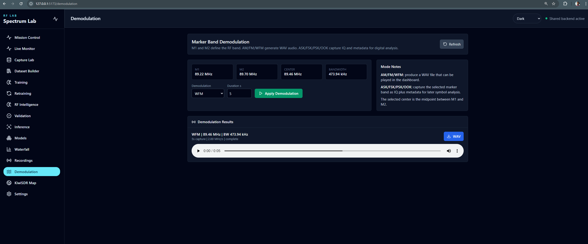
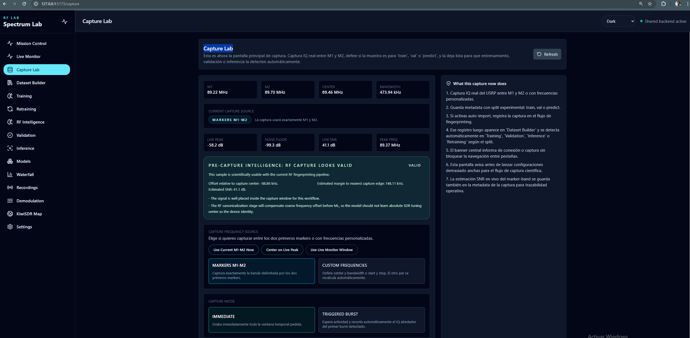

# SpectraEase Backend

FastAPI backend for the SpectraEase RF spectrum analyzer.

The current active hardware path uses a real **Ettus Research USRP-B200** through **UHD/GNU Radio**. The backend starts helper tools with the RadioConda Python executable and returns live spectrum frames captured from the device.

## Active Device Flow

- Driver reported by the API: `uhd_gnuradio`
- Device currently used: `USRP-B200 from Ettus Research`
- Capture source: real UHD/GNU Radio samples
- Default antenna: `RX2`
- Default center frequency: `89.4 MHz`
- Default sample rate/span: `2 MS/s`
- Default gain: `20 dB`

The active API does not generate mock spectrum data. If the device cannot be opened or no frame is available, the spectrum endpoint returns a real SDR error or pending state.

## Main Components

- `app/infrastructure/web/controllers/device_controller.py`
  - Connects/disconnects the real SDR flow
  - Starts/stops live spectrum streaming
  - Reports device status

- `app/infrastructure/web/controllers/spectrum_controller.py`
  - Serves live spectrum data
  - Updates center frequency, span, start/stop, RBW, VBW, reference level, detector mode, and averaging

- `app/infrastructure/web/controllers/demodulation_controller.py`
  - Captures the RF band selected by M1 and M2
  - Runs marker-band AM/FM/WFM audio demodulation
  - Stores demodulation metadata and WAV output for dashboard playback/export

- `app/infrastructure/web/controllers/modulated_signal_controller.py`
  - Captures, lists, downloads, and safely deletes marker-limited or custom-window `.cfile` or `.iq` files for `Capture Lab`
  - Persists metadata for replay workflows and AI datasets, including live preview metrics
  - Lists and serves generated IQ/metadata files from disk

- `app/modules/fingerprinting/service.py`
  - Imports captures into the fingerprinting registry
  - Computes offline QC from stored IQ data
  - Estimates SNR, occupied bandwidth, peak frequency/offset, burst bounds, silence, and clipping
  - Applies automatic review flags before dataset curation
  - Preserves burst RF samples as valid when the sample is usable but the capture window is tight
  - Recent update: for `burst_rf_v1`, conditions such as `occupied_bandwidth_near_capture_limit`, `peak_not_ideally_centered` and `low_margin_to_nearest_edge` are now warnings, not automatic reject/doubtful triggers, cuando el SNR es bueno y no hay clipping u otros fallos graves.

- `app/modules/mlops/service.py`
  - Starts training, retraining, validation, and inference jobs
  - Tracks async job status, stdout, stderr, and generated reports
  - Bridges the unified app with the RF fingerprint platform scripts
  - Exports curated captures into canonical RF fingerprinting datasets
  - Preserves raw I/Q files while creating ML-ready canonical I/Q copies
  - Estimates signal offset from QC metadata or Welch PSD, shifts to baseband, filters the useful band, resamples when required, normalizes RMS power, and writes segment manifests

- `app/modules/rf_experiment_lab/`
  - Adds the optional reproducible RF Experiment Lab layer
  - Consumes existing captures and metadata without modifying the operational capture, waterfall, RF Intelligence or RF Signal Understanding paths
  - Provides SigMF export, HDF5 experiment manifests, dataset versioning, representation extraction and experiment result packages
  - Implements E0 Morphological Baseline, E5 Spectral Feature Baseline, E1 Raw IQ CNN 1D and E3 Spectrogram/Waterfall CNN 2D
  - Registers experiment listing, detail, comparison and benchmark-report endpoints
  - Reports missing optional dependencies cleanly through stable JSON instead of breaking backend startup

- `app/infrastructure/sdr/real_spectrum_stream.py`
  - Manages the persistent spectrum worker process
  - Restarts the worker when tuning parameters change

- `tools/spectrum_stream_worker.py`
  - Opens the USRP through GNU Radio/UHD
  - Captures IQ samples
  - Produces FFT spectrum frames as JSON

## Run Backend Manually

On Windows, install the Ettus UHD runtime/USB driver before starting the backend:

- Windows 11 UHD builds/drivers: `https://files.ettus.com/binaries/uhd/latest_release/Windows11/VS2026/`
- All latest UHD release builds: `https://files.ettus.com/binaries/uhd/latest_release/`

Verify the radio is visible to UHD:

```powershell
& 'C:\Program Files\UHD\bin\uhd_find_devices.exe'
& 'C:\Program Files\UHD\bin\uhd_usrp_probe.exe'
```

The recommended development entrypoint is the project script:

```powershell
cd C:\path\to\spectrum-lab

$env:DEFAULT_CENTER_FREQUENCY_HZ="89400000"
$env:DEFAULT_SAMPLE_RATE_HZ="2000000"
$env:DEFAULT_GAIN_DB="20"
$env:DEFAULT_ANTENNA="RX2"
$env:UHD_DEVICE_ARGS=""

powershell -ExecutionPolicy Bypass -File .\scripts\run_dev.ps1 -UseRealSdr 1 -RadioCondaPythonPath "C:\path\to\radioconda\python.exe"
```

If running only the backend, make sure `RADIOCONDA_PYTHON` points to the Python executable that has GNU Radio and UHD:

```powershell
$env:RADIOCONDA_PYTHON="C:\path\to\radioconda\python.exe"
cd backend
.\venv\Scripts\python.exe -m uvicorn app.main:app --reload --host 0.0.0.0 --port 8000
```


## Backend Modular API Architecture

The backend API surface is split physically under `backend/app/modules`. Each API/domain area owns a module definition, and `main.py` only calls the registry composer:

```text
backend/app/modules/
  capture_lab/module.py
  demodulation/module.py
  device/module.py
  fingerprinting/api_module.py
  kiwisdr/api_module.py
  markers/module.py
  mlops/api_module.py
  presets/module.py
  recordings/module.py
  rf_experiment_lab/api_module.py
  sessions/module.py
  spectrum/module.py
  waterfall/module.py
  registry.py
  types.py
```

Each backend module declares a stable ID, name, enabled flag, order, description, and a `build_router(context)` function. `backend/app/modules/registry.py` composes the active modules and registers their FastAPI routers under the configured API prefix. This keeps endpoint ownership physically separated while preserving the existing controllers, services, routes, and URL contracts. Existing domain modules such as `fingerprinting`, `kiwisdr`, and `mlops` keep their internal services and expose API registration through `api_module.py` to avoid breaking their current package structure.

To disable an API module without deleting code, set its `enabled` flag to `False` in that module's definition. To add a new backend module, create a new folder under `backend/app/modules/` with a `module.py` or `api_module.py` and add it to `backend_modules` in `registry.py`.

## Key API Endpoints

- `GET /api/device/status`
- `POST /api/device/connect`
- `POST /api/device/disconnect`
- `POST /api/device/stream/start`
- `POST /api/device/stream/stop`
- `POST /api/device/frequency`
- `POST /api/device/gain`
- `GET /api/spectrum/live`
- `POST /api/spectrum/center-frequency`
- `POST /api/spectrum/span`
- `POST /api/spectrum/start-stop`
- `POST /api/spectrum/rbw`
- `POST /api/spectrum/vbw`
- `POST /api/spectrum/reference-level`
- `POST /api/spectrum/noise-floor-offset`
- `POST /api/spectrum/detector-mode`
- `POST /api/spectrum/averaging`
- `POST /api/spectrum/scpi`
- `POST /api/demodulation/marker-band`
- `GET /api/demodulation/results`
- `GET /api/demodulation/results/{id}`
- `GET /api/demodulation/audio/{id}`
- `POST /api/modulated-signals/captures`
- `GET /api/modulated-signals/captures`
- `GET /api/modulated-signals/captures/{id}`
- `GET /api/modulated-signals/captures/{id}/iq`
- `GET /api/modulated-signals/captures/{id}/metadata`
- `GET /api/fingerprinting/dashboard`
- `GET /api/fingerprinting/captures`
- `POST /api/fingerprinting/captures`
- `POST /api/fingerprinting/captures/{capture_id}/review`
- `POST /api/fingerprinting/import/modulated-capture/{capture_id}`
- `GET /api/mlops/training/dashboard`
- `POST /api/mlops/training/start`
- `POST /api/mlops/training/retrain`
- `GET /api/mlops/training/status`
- `POST /api/mlops/validation/run`
- `POST /api/mlops/validation/start`
- `GET /api/mlops/validation/status`
- `GET /api/mlops/validation/reports`
- `POST /api/mlops/inference/predict/start`
- `GET /api/mlops/inference/predict/status`
- `GET /api/rf-experiment-lab/health`
- `GET /api/rf-experiment-lab/experiments`
- `GET /api/rf-experiment-lab/experiments/{experiment_id}`
- `POST /api/rf-experiment-lab/experiments/compare`
- `POST /api/rf-experiment-lab/benchmark/report`
- `POST /api/rf-experiment-lab/sigmf/preview`
- `POST /api/rf-experiment-lab/sigmf/export`
- `POST /api/rf-experiment-lab/hdf5-manifest/preview`
- `POST /api/rf-experiment-lab/hdf5-manifest/export`
- `POST /api/rf-experiment-lab/representations/raw-iq/preview`
- `POST /api/rf-experiment-lab/representations/raw-iq/export`
- `POST /api/rf-experiment-lab/representations/fft-psd/preview`
- `POST /api/rf-experiment-lab/representations/fft-psd/export`
- `POST /api/rf-experiment-lab/representations/spectrogram/preview`
- `POST /api/rf-experiment-lab/representations/spectrogram/export`
- `POST /api/rf-experiment-lab/representations/waterfall/preview`
- `POST /api/rf-experiment-lab/representations/waterfall/export`
- `POST /api/rf-experiment-lab/representations/manifest/export`
- `POST /api/rf-experiment-lab/experiments/e0-morphological-baseline/preview`
- `POST /api/rf-experiment-lab/experiments/e0-morphological-baseline/run`
- `POST /api/rf-experiment-lab/experiments/e5-spectral-baseline/preview`
- `POST /api/rf-experiment-lab/experiments/e5-spectral-baseline/run`
- `POST /api/rf-experiment-lab/experiments/e1-raw-iq-cnn1d/preview`
- `POST /api/rf-experiment-lab/experiments/e1-raw-iq-cnn1d/run`
- `POST /api/rf-experiment-lab/experiments/e3-spectrogram-cnn2d/preview`
- `POST /api/rf-experiment-lab/experiments/e3-spectrogram-cnn2d/run`

OpenAPI docs are available at `http://localhost:8000/docs` when the backend is running.

## RF Experiment Lab Backend Layer

RF Experiment Lab is a removable backend extension. It must remain optional and must not be a dependency of the current operational SDR laboratory.

The backend split is:

```text
Operational path
  device / spectrum / waterfall / markers
  demodulation
  Capture Lab
  Dataset Builder and fingerprinting registry
  RF Intelligence
  RF Signal Understanding
  MLOps training, validation and inference

Experimental path
  rf_experiment_lab dataset adapter
  exporters
  representations
  experiment families
  metrics and comparison
  benchmark report
```

Every RF Experiment Lab response uses a stable envelope:

```text
status
module
available
message
data
errors
```

This is important because some features depend on optional packages:

- `sklearn` for E5 classical model training
- `torch` for E1 and E3 training
- `torchvision` for E3 `resnet18` and `vgg11`
- `scipy` for optional Welch PSD support
- `h5py` for future binary HDF5 writing

If an optional dependency is missing, the affected endpoint returns `available=false` or a clean error in the stable envelope. Backend startup must continue.

### Implemented experiments

| ID | Name | Task | Input | Model type | Output |
|----|------|------|-------|------------|--------|
| E0 | Morphological Baseline | Region detection baseline | Waterfall or spectrogram metadata | Existing `morphological_heuristic` adapter | `detections.json`, `metrics.json`, runtime log |
| E5 | Spectral Feature Baseline | Explainable classification baseline | `fft_psd`, PSD summary, optional raw-IQ spectral features | Logistic Regression, Random Forest, SVM RBF, KNN | features, model, metrics, predictions, confusion matrices, feature importance |
| E1 | Raw IQ CNN 1D | Closed-set device fingerprinting | `raw_iq` windows shaped `[2, N]` | Small CNN 1D | model, metrics, predictions, history, group/confidence/overfitting summaries |
| E3 | Spectrogram/Waterfall CNN 2D | Closed-set signal recognition or fingerprinting | `spectrogram` or `waterfall` shaped `[1, H, W]` | simple CNN 2D, optional ResNet18, optional VGG11 | model, metrics, predictions, history, group/confidence/overfitting summaries |

E0 is the permanent fallback and baseline. Learned detectors such as SSD, Faster R-CNN and YOLO are not implemented yet and must report `not_implemented`, not fake results.

### Reproducibility services

The backend now supports:

- SigMF preview/export from `.cfile + .json` or `.iq + .json`
- HDF5 experiment manifest preview/export without requiring binary HDF5 support
- Dataset version objects with source capture hashes
- Representation extraction for `raw_iq`, `fft_psd`, `spectrogram` and `waterfall`
- Representation manifest export with artifact paths and SHA-256 hashes
- Experiment registry listing and detail loading
- Cross-experiment comparison
- Consolidated benchmark reports across E1, E3 and E5

Preview endpoints do not write files. Export/run endpoints write into controlled output directories and preserve original captures.

### Scientific split discipline

The experiment layer avoids random window splits as the scientific default. Supported group-disjoint strategies include:

- `capture_disjoint`
- `session_disjoint`
- `day_disjoint`
- `environment_disjoint`
- `distance_disjoint`
- `receiver_disjoint`
- `device_holdout`

The default split is `session_disjoint`. Benchmark reports warn when experiments use different dataset versions, different split strategies, missing metrics, missing group metrics, incompatible label spaces, low sample counts or debug/random splits.

## Marker-Band Demodulation

`POST /api/demodulation/marker-band` captures real IQ from the USRP-B200 between the two frequencies supplied by the frontend, normally M1 and M2.



Example body:

```json
{
  "start_frequency_hz": 89320000,
  "stop_frequency_hz": 89450000,
  "mode": "fm",
  "duration_seconds": 5
}
```

Supported modes:

- `am`, `fm`, `wfm`: capture IQ, generate WAV audio, expose `/api/demodulation/audio/{id}`
- `ask`, `fsk`, `psk`, `ook`: capture IQ and metadata for digital analysis/export

The backend applies the same RF safety checks used by spectrum tuning before opening the USRP-B200.

## Modulated Signal IQ Captures

`POST /api/modulated-signals/captures` captures the selected RF band as raw complex64 IQ plus JSON metadata. The request can choose `file_format` as `cfile` or `iq`, and the frontend may define the band from markers or from a custom frequency window.

<table>
  <tr>
    <td width="50%">
      
      <br>
      <strong>Capture request path</strong>
      <br>
      The backend receives marker/custom frequency windows, applies RF guardrails, and writes IQ plus metadata.
    </td>
    <td width="50%">
      
      <br>
      <strong>Generated artifacts</strong>
      <br>
      Persistent `.cfile` / `.iq` outputs are paired with replay metadata and dataset labels.
    </td>
  </tr>
</table>

Example body:

```json
{
  "start_frequency_hz": 89320000,
  "stop_frequency_hz": 89500000,
  "duration_seconds": 5,
  "file_format": "iq",
  "label": "device_01_signal_a",
  "modulation_hint": "fsk",
  "notes": "Capture for offline analysis and AI dataset generation"
}
```

Files are stored in:

```text
backend/app/infrastructure/persistence/storage/recordings/modulated_signal_captures/
backend/app/infrastructure/persistence/storage/recordings/modulated_signal_iq_captures/
```

Each metadata file includes capture identity, selected file format, frequency limits, center frequency, bandwidth, sample rate, gain, antenna, IQ format, sample count, file size, SHA256, label, modulation hint, notes, and replay parameters.

If the capture is imported into the fingerprinting registry, the backend runs offline QC on the stored IQ file and derives:

- estimated SNR
- occupied bandwidth
- peak frequency
- frequency offset
- burst start/end
- silence percentage
- clipping percentage

This is separate from the live preview shown in the frontend.


### RF QC Profiles

The fingerprinting registry now separates QC by signal family instead of applying one burst detector to every RF capture.

- `continuous_fm_v1`: for continuous FM/broadcast-like channels. Uses spectral peak detection, spectral/channel SNR, occupied bandwidth, channel presence, edge margin, clipping, and raw IQ diagnostics. Temporal silence is not a rejection criterion for this profile.
- `burst_rf_v1`: for intermittent RF, remotes, ASK/OOK, packet-like captures, and short events. Uses burst-region detection, burst SNR, silence, burst duration, clipping, and artifact diagnostics.

Each imported or recomputed capture stores `signal_family`, `qc_profile_id`, `qc_profile`, `snr`, and `iq_file_diagnostics`. The IQ diagnostics include sample count, actual duration, dtype, endianness, mean/RMS power, zero and near-zero ratios, NaN/Inf ratios, and spectral peak offset. This makes it possible to distinguish a genuinely bad/corrupt IQ file from a QC profile mismatch.

For continuous FM, the selected review SNR is spectral/channel SNR. For burst RF, the selected review SNR is burst/temporal SNR. Continuous FM captures are never rejected because a burst detector reports high temporal silence; if the channel is present but the occupied bandwidth nearly fills the selected capture window, the capture is marked doubtful rather than rejected.

### Behavior change for `burst_rf_v1`

The backend now distinguishes dataset usability from signal quality warnings in the same spirit as the older v3 policy for intermittent RF captures.

- `burst_rf_v1` sigue aceptando como `valid` una captura usable cuando:
  - el SNR es bueno (`>= 15 dB`)
  - no hay clipping significativo (`<= 1%`)
  - el IQ file es correcto y la adquisición es recuperable mediante canonicalización
  - el método de análisis es `spectral_peak_detection`
- Las condiciones de ventana ajustada se conservan como advertencias:
  - `occupied_bandwidth_near_capture_limit`
  - `peak_not_ideally_centered`
  - `low_margin_to_nearest_edge`
- Solo se consideran motivos de rechazo automático los fallos claros:
  - señal fuera de la banda
  - silencio excesivo
  - ráfaga demasiado corta
  - muestras perdidas o buffer overflow
  - margen al borde extremadamente bajo (< 20 kHz)

Este ajuste evita que una muestra usable para entrenamiento RF fingerprinting sea descartada solo porque la banda capturada está apretada o la señal está cercana al borde de la ventana.

### Políticas prácticas para `burst_rf_v1`

- `review_status` debe reflejar la usabilidad del dataset.
- `rf_intelligence` debe reflejar la calidad de adquisición y advertencias operativas.

En la política recomendada:

- `VALID` cuando:
  - `SNR >= 15 dB`
  - `clipping_pct <= 1%`
  - `silence_pct = 0%` o fallback espectral válido
  - `channel_presence_ratio` alto
  - `IQ near-zero` bajo
  - fichero IQ correcto
  - canonicalización posible
- `DOUBTFUL` cuando:
  - el margen al borde es pequeño pero no crítico
  - `occupied_bandwidth_near_capture_limit` está presente
  - `peak_not_ideally_centered` está presente
  - `pre_post_qc_mismatch` está presente
  - no hay fallos graves en el IQ o en la señal
- `REJECT` solo cuando hay fallos claros como:
  - IQ corrupto o vacío
  - IQ near-zero alto
  - clipping grave
  - SNR muy bajo
  - señal fuera de la ventana
  - margen prácticamente nulo

### Ejemplos de decisión

#### Captura 1
- Margen al borde: 11.84 kHz
- Estado recomendado: `doubtful`
- Motivo: margen de ventana demasiado pequeño para confiar plenamente en esta adquisición

#### Captura 2
- Margen al borde: 97.97 kHz
- Estado recomendado: `valid`
- Motivo: señal usable, margen razonable, sin clipping, sin silencio, IQ íntegro

### Analítica de sangre para QC

| Parámetro | Rango objetivo | Síntoma | Acción |
|---|---|---|---|
| `SNR` | >= 15 dB | Señal buena | Dataset usable |
| `Clipping` | 0–1% | Sin saturación | Dataset usable |
| `Silence` | 0% | Ráfaga presente | Dataset usable |
| `IQ near-zero` | 0% | Fichero íntegro | Dataset usable |
| `Occupied bandwidth ratio` | 90–99% | Ventana ajustada | Warning |
| `Margin al borde` | > 20 kHz | Suficiente guarda lateral | Valid |
| `Pre/post QC mismatch` | Bajo | Validación offline diferente | Warning |
| `Peak centering` | Centralizado idealmente | Band edge risk | Warning |

> En este modelo, los problemas de captura se leen como alteraciones de laboratorio: el resultado principal puede estar sano (`valid`) aun cuando algunas métricas estén en la zona de advertencia.

A comparison endpoint is available for investigating inconsistent captures:

```text
GET /api/fingerprinting/captures/compare/{left_capture_id}/{right_capture_id}
```

It reports metadata differences, sample-rate/duration differences, mean-power differences, spectral peak differences, occupied-bandwidth differences, SNR differences, zero/near-zero ratios, QC profile differences, detection method differences, ROI policy differences, and decision differences.

## RF Fingerprinting MLOps And Canonicalization

Training, retraining, and validation use curated captures from the fingerprinting registry. The backend rebuilds internal datasets before each ML lifecycle operation instead of training directly on arbitrary raw files.

The exported ML dataset is canonicalized. The original `.cfile` or `.iq` remains untouched, and the exported record keeps `original_center_frequency_hz`, `original_sample_rate_hz`, `original_bandwidth_hz`, estimated signal center, estimated offset, and the applied frequency shift as auditable metadata.

Canonical preprocessing performs:

```text
raw .cfile/.iq
  -> read original metadata
  -> estimate signal peak / occupied center from QC or Welch PSD
  -> estimate offset relative to SDR center
  -> digital frequency shift to baseband
  -> FIR low-pass useful-band filtering
  -> polyphase resampling when canonical sample rate differs
  -> RMS power normalization
  -> complete-window segment manifest generation
  -> canonical dataset for training/validation
```

Compatibility rules are based on canonical representation, not absolute SDR tuning center. Multiple original `center_frequency_hz` values are allowed when exported records share one `preprocessing_profile_id`, one `canonical_sample_rate_hz`, one `canonical_bandwidth_hz`, and one `canonical_segment_length_samples`. Validation must match the trained model canonical configuration and must not reuse `(device, session)` pairs from the training manifest.

## Validation And Inference Runtime

The backend accepts `python_exe` overrides for validation and inference, but if the field is empty it falls back to `RADIOCONDA_PYTHON`. The frontend launcher now forwards this path to the UI so the operator normally sees the correct value prefilled.

Inference prediction is asynchronous. The backend returns a `job_id`, then exposes status, `stdout`, `stderr`, and the final report through the prediction status endpoint.

## Runtime Configuration

| Variable | Purpose |
|----------|---------|
| `RADIOCONDA_PYTHON` | Python executable with GNU Radio/UHD |
| `DEFAULT_CENTER_FREQUENCY_HZ` | Startup center frequency |
| `DEFAULT_SAMPLE_RATE_HZ` | Startup sample rate/span |
| `DEFAULT_GAIN_DB` | Startup gain |
| `DEFAULT_ANTENNA` | UHD antenna name |
| `UHD_DEVICE_ARGS` | Optional UHD device selector |
| `VITE_RADIOCONDA_PYTHON` | Frontend runtime copy of the RadioConda path, injected by the dev launcher |
| `REAL_SDR_FPS` | Spectrum worker frame rate |
| `REAL_SDR_MAX_FFT_SIZE` | Maximum FFT size used to approach requested RBW |

RBW changes the FFT size used by the live spectrum worker. VBW applies frame-to-frame video smoothing after FFT detection; values much higher than the frame rate behave like no smoothing.

## RF Safety Guardrails

The backend rejects unsafe or invalid hardware-facing settings before they reach UHD:

| Parameter | Default software range |
|-----------|------------------------|
| Center frequency | `70 MHz` to `6 GHz` |
| Sample rate / span | `200 kS/s` to `61.44 MS/s` |
| Gain | `0 dB` to `60 dB` |
| RBW | `1 Hz` to `1 MHz` |
| VBW | `1 Hz` to `1 MHz` |

The safety status is also exposed through:

```text
GET /api/spectrum/safety-limits
```

These checks reduce accidental misconfiguration. They do not replace RF input protection; avoid injecting high-power signals directly into the USRP-B200 input.

## SCPI-Style Commands

Basic external-control commands are accepted through `POST /api/spectrum/scpi` with a JSON body:

```json
{ "command": "SENS:FREQ:CENT 89.4MHz" }
```

Supported commands:

- `SENS:FREQ:CENT <value>[Hz|kHz|MHz|GHz]`
- `SENS:FREQ:SPAN <value>[Hz|kHz|MHz|GHz]`
- `DISP:TRAC:Y:RLEV <value>[dB|dBm]`
- `DISP:TRAC:Y:SCAL:PDIV <value>dB`

## Troubleshooting

- Confirm the USRP-B200 is connected over USB.
- On Windows, reinstall or repair the Ettus UHD USB driver if UHD reports `No UHD Devices Found`.
- Confirm the radio is visible with `C:\Program Files\UHD\bin\uhd_find_devices.exe` and opens with `C:\Program Files\UHD\bin\uhd_usrp_probe.exe`.
- Confirm RadioConda can import `gnuradio` and `uhd`.
- Confirm the app was started with `-UseRealSdr 1`.
- Confirm `RADIOCONDA_PYTHON` points to `C:\path\to\radioconda\python.exe`.
- If `/api/spectrum/live` returns `real_sdr_pending`, wait for the first frame.
- If it returns `real_sdr_error`, check the error field and the backend terminal output.
